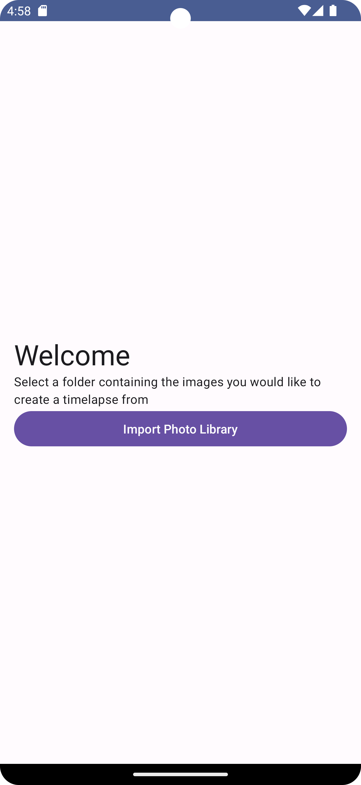
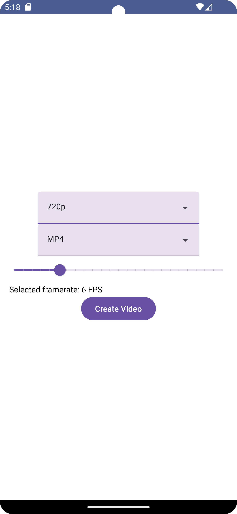
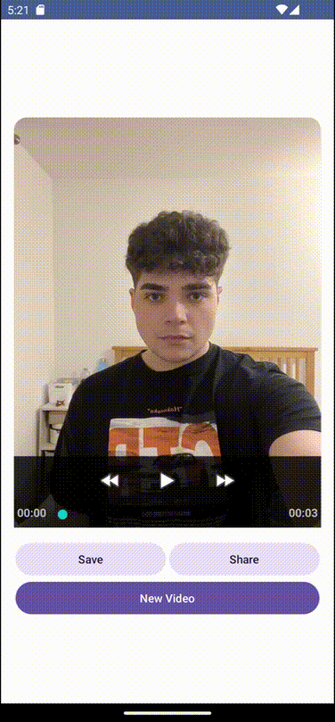

# face-timelapse-maker-android
Native android app for creating stabilised face timelapses. Technologies used include Jetpack Compose, FFMpeg and Room. This app uses

## Import photos
User imported images persist using a Room database.

  
  

## Configure and create a timelapse
User is able to configure their timelapse. FFMpeg allows for quality, framerate and format selection. The resulting video can be saved to downloads or shared.

  
  

## TODO
- Projects
  - Allow user to create multiple projects for different timelapses
  - Project editing; remove/add images to an existing project after photo import
  - Add photos to project using camera from within the app
- Face alignment
  - Either locally or on cloud, use OpenCV or an existing API to line up faces between each image.
